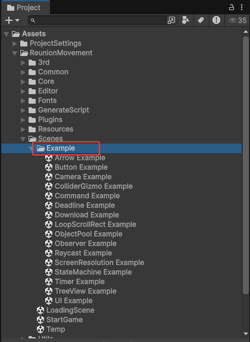
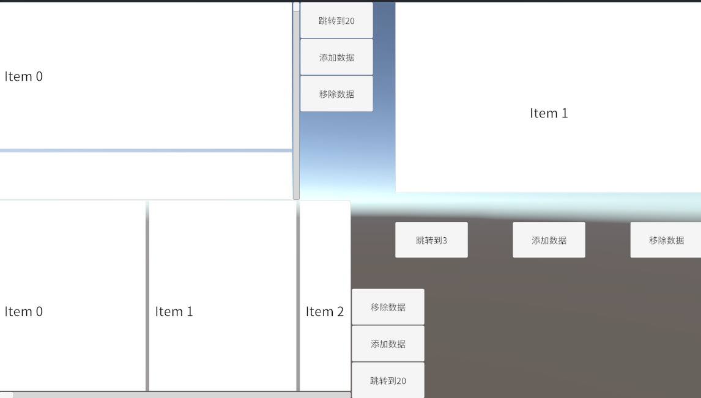
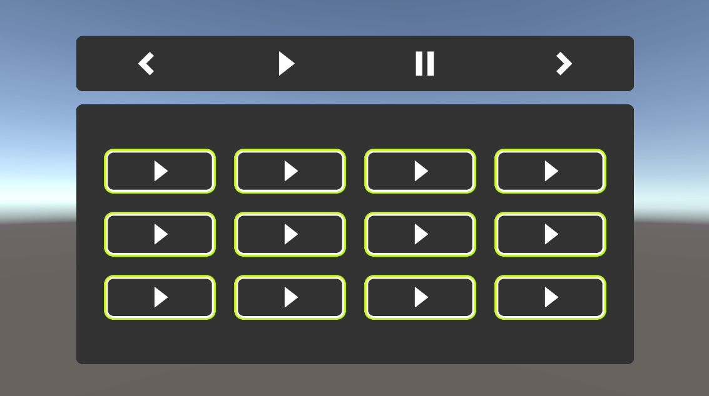
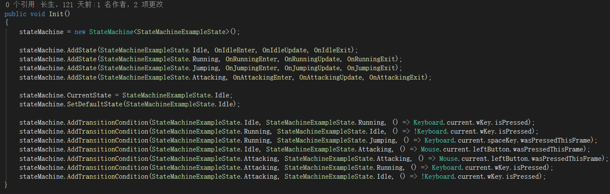
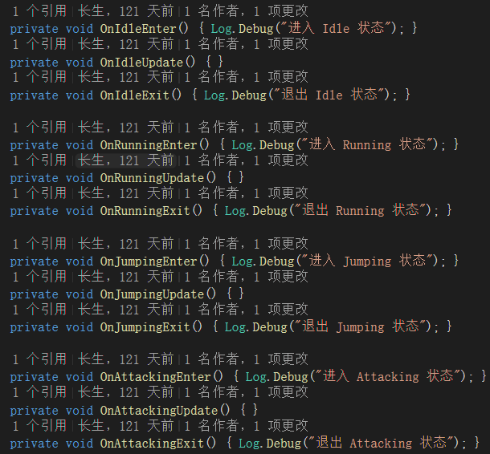

# Reunion-Movement
Unity Game Framework | Unity游戏框架
Unity Version : 6000.1.10f1

注意：该框架只支持 New Input System 
说明：此项目是重构的LLAFramework，由于LLAFramework有太多的多余代码所以我打算从新重构该项目。 

- [工具](#Tool)
- [功能](#Function)
- [示例](#Example)
- [目录](#Catalogue)
- [感谢](#Thanks)

## 工具：
表格工具 
碰撞器工具 
文件夹工具 
UI工具 
ImageEx 

## 功能：
EventMessageSystem 
LanguagesSystem 
ResourcesSystem 
SceneSystem 
SoundSystem 
UISystem 
TerminalSystem 

## 示例：
项目的例子在 Assets -> ReunionMovement -> Scenes -> Example 中 

Arrow Example： 
展示箭头  

Button Example： 
展示Button  

Camera Example： 
展示Camera  

ColliderGizmo Example： 
展示编辑模式显示碰撞器工具 

Command Example： 
展示Command工具，该场景演示了如何实 Undo / Redo  

Deadline Example： 
展示Deadline工具，该工具用于截止日期检测  

Download Example： 
展示下载 

LoopScrollRect Example： 
展示循环列表 

Music Example： 
展示音乐播放 

Observer Example： 
展示观察者例子 

Raycast Example： 
展示射线例子 

ScreenResolution Example： 
展示屏幕分辨率工具 

StateMachine Example： 
展示状态机的使用 

Timer Example： 
展示计时和倒计时的使用 

TreeView Example： 
展示树状图 

ImageEx Example： 
展示ImageEX和着色器的场景 

## 目录：
- Assets
  - ReunionMovement
    - 3rd
    - Common
    - Core
    - Editor
    - Fonts
    - GenerateScript
    - Plugins
    - Resources
    - Scenes
      - Example
    - Utils

## 感谢：
感谢Shadertoy上的作者所做的贡献 
https://www.shadertoy.com/ 

感谢以下的开源项目 
https://github.com/mob-sakai/UIEffect 