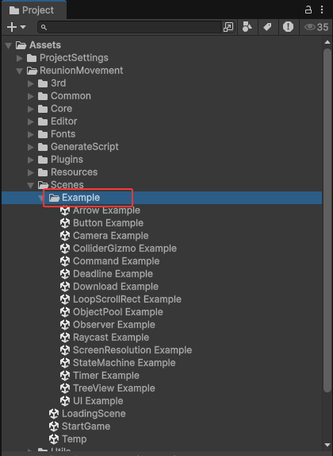
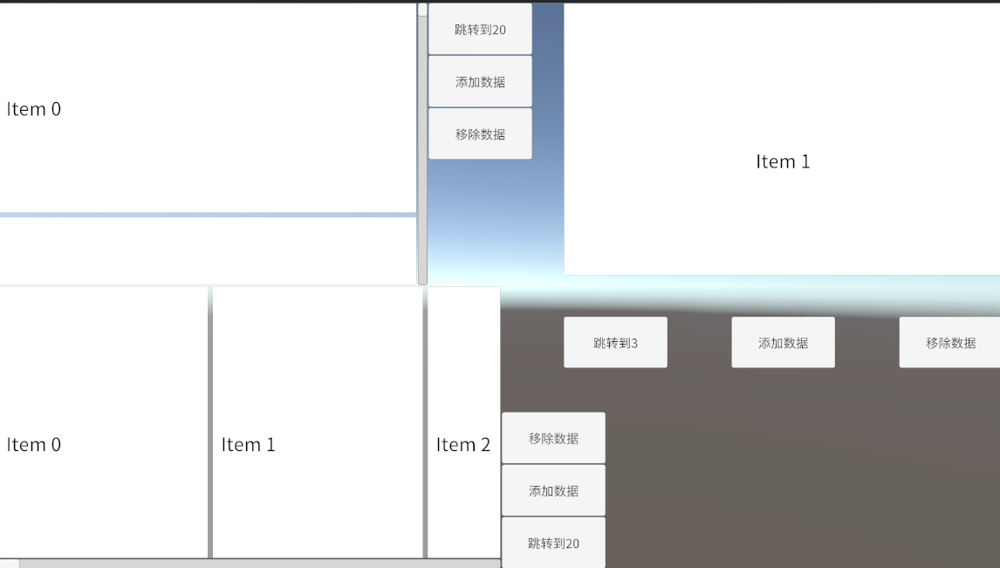
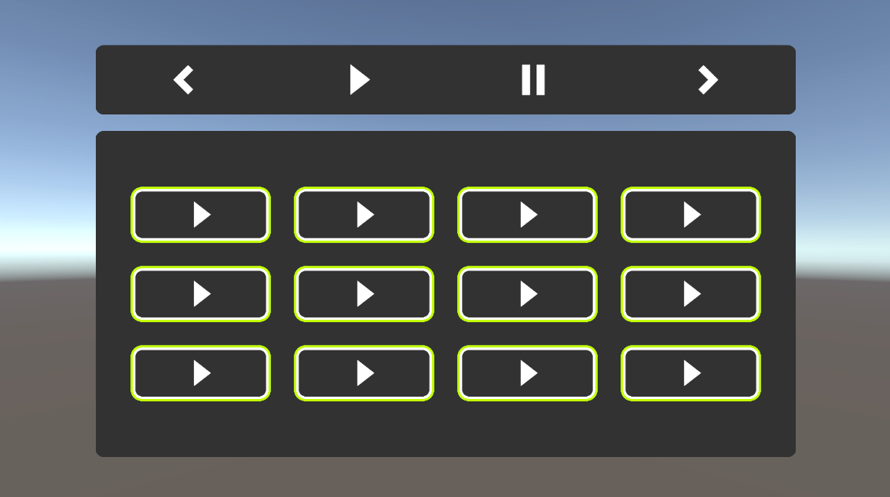
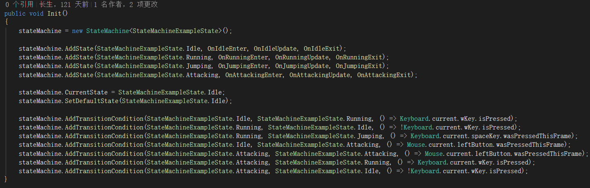
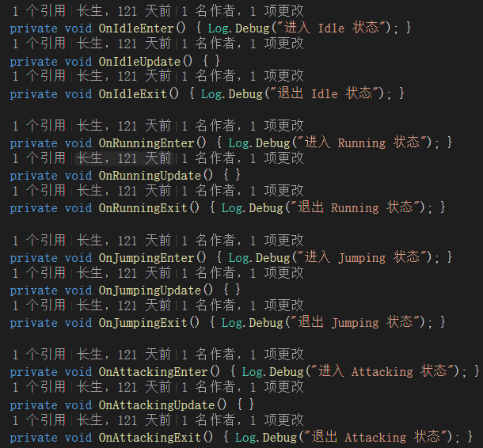

# Reunion-Movement 整合运动
Unity Game Framework | Unity游戏框架

**Unity Version** : 6000.3.10f1（Unity 6 / URP 17.3） 

> 说明：此项目是重构的 LLAFramework，由于 LLAFramework 有太多多余代码，所以从零开始重构本项目。

## 环境与依赖
- 必须开启：**TextMesh Pro**、**New Input System**（Project Settings → Player → Active Input Handling 需包含 Input System Package）。
- 低版本兼容：低于 2022.3 的版本在示例中 TextMesh Pro 可能报错，需要重新生成 Font Asset（报错不影响框架逻辑）；更低版本（如 2019）可能需要手动解决少量语法差异。

### 主要依赖（Packages / Plugins）
| 依赖 | 版本 | 用途 |
|---|---|---|
| com.unity.inputsystem | 1.18.0 | 新输入系统（键盘 / 手柄 / UI 导航） |
| com.unity.addressables | 2.9.0 | 资源远程更新与内存管理 |
| com.unity.render-pipelines.universal | 17.3.0 | URP 渲染管线 |
| com.unity.ugui | 2.0.0 | uGUI |
| UniTask | Plugins | 高性能异步 / 协程替代 |
| R3 | Plugins | 响应式编程（事件 / Subject） |
| ZString | Plugins | 零分配字符串格式化 |
| DOTween | Plugins | 补间动画 |
| kcp2k / Telepathy / SimpleWebTransport | Plugins | KCP / TCP / WebSocket 网络传输 |

## 特性
- **零分配日志**：ZString 池化缓冲 + `[Conditional]` 条件编译，日志格式化零 GC。
- **响应式事件总线**：R3 Subject 驱动的 `EventMessageSystem`，含泛型零装箱通道。
- **统一生命周期引擎**：纯 C# `GameEngine` + `GameEngineDriver` 桥接，模块化 `ICustomSystem`，`[RuntimeInitializeOnLoadMethod]` 自动启动。
- **多传输网络层**：TCP(Telepathy) / KCP(kcp2k) / WebSocket(SimpleWebTransport) 统一 `INetworkChannel` 抽象，支持心跳与自动重连。
- **断点续传下载**：HTTP 分块下载（>2GB 支持）、MD5 校验、多线程并发调度、超时兜底。
- **SDF 形状 UI**：`ImageEx` 基于 SDF 着色器实现 12 种形状（四边形 / 心形 / 六边形 / 圆角等）+ 渐变 / 模糊 / 描边 / 过渡特效。
- **循环滚动列表**：`LoopScrollRect` 对象池 + 虚拟化 + 数据索引缓存，滚动零 GC、选中状态零 GetComponent。
- **UI Toolkit 面板系统**：`UIToolkitSystem` 异步加载 UXML/USS，面板栈管理。
- **WebGL 体积优化**：ImageEx Shader 变体剥离器（过渡 / 模糊 / 描边组合裁剪）。

## 工具：
- **表格工具**：Excel → 脚本 / ScriptableObject / JSON（批量生成，支持自定义数组类型）
- **碰撞器工具**：编辑模式 Gizmo 可视化显示碰撞器
- **文件夹工具**：项目内快速打开/定位文件夹
- **UI 工具**：CreateUIPlane 一键生成 UI 面板脚本（含覆盖保护）
- **小功能窗口**：场景切换 / 屏幕日志 / FPS / UI 波纹（全部支持 Undo）
- **ImageEx**：SDF 形状图片 + 渐变/模糊/描边/过渡特效
- **ImageEx Editor**：形状/特效参数可视化编辑，含相机画面（Camera Feed）接入
- **Shader 变体剥离器**：WebGL 构建体积优化

## 功能（系统）：
| 系统 | 说明 |
|---|---|
| `GameEngine` / `Bootstrap` | 纯 C# 引擎生命周期，自动启动，测试场景自动跳过场景跳转 |
| `EventMessageSystem` | 响应式事件总线（R3 Subject + 泛型零装箱） |
| `LanguagesSystem` | 多语言本地化（TextMeshPro 自动翻译） |
| `ResourcesSystem` | Resources / Addressables 加载 + 引用计数缓存 + 图集 |
| `SceneSystem` | 场景加载（进度 / 过渡场景 / 并发锁 / 状态恢复） |
| `SoundSystem` | 音乐/音效（LRU 缓存 / 淡入淡出 / 对象池 / 并发去重加载） |
| `UISystem` | uGUI 窗口管理（加载 / 打开 / 关闭 / 层级 / 静态 UI） |
| `UIToolkitSystem` | UI Toolkit 面板管理（异步加载 / 面板栈） |
| `UIInputSystem` | 输入模式切换（Gameplay ↔ UIControl）、键盘/手柄 UI 导航、焦点栈 |
| `TerminalSystem` | 运行时控制台（`[RegisterCommand]` 源码生成器注册） |
| `NetworkMgr` | 多通道网络管理（TCP / KCP / WebSocket，跨场景持久） |
| `DownloadMgr` | 多文件断点下载 / 图片下载 |
| `HttpMgr` | HTTP 请求封装（GET / POST / 进度 / 取消） |
| `TimerMgr` | 计时器 / 倒计时 |
| `StateMachine` | 泛型状态机（并行状态 / 超时 / 历史回退） |
| `GachaSystem` | 加密随机抽卡系统（无可预测性） |
| `ObjectPool` | 通用对象池 |
| `ResolutionMgr` | 屏幕分辨率 / 全屏 / 帧率 |
| `SafeArea` | 刘海屏安全区适配 |
| `ScreenLogger` | 屏幕日志显示 |
| `DeadlineMgr` | 截止日期检测 |

## 示例：
项目的例子在 Assets -> ReunionMovement -> Scenes -> Example 中 

Arrow Example： 
展示箭头  

Button Example： 
展示Button  

Camera Example： 
展示Camera  

ColliderGizmo Example： 
展示编辑模式显示碰撞器工具 

Command Example： 
展示Command工具，该场景演示了如何实 Undo / Redo  

Deadline Example： 
展示Deadline工具，该工具用于截止日期检测  

Download Example： 
展示下载 

LoopScrollRect Example： 
展示循环列表 

Music Example： 
展示音乐播放 

Observer Example： 
展示观察者例子 

Raycast Example： 
展示射线例子 

ScreenResolution Example： 
展示屏幕分辨率工具 

StateMachine Example： 
展示状态机的使用 

Timer Example： 
展示计时和倒计时的使用 

TreeView Example： 
展示树状图 

ImageEx Example： 
展示ImageEX和着色器的场景 

Network Example： 
展示网络连接与数据传输（TCP / KCP / WebSocket） 

ObjectPool Example： 
展示通用对象池的使用 

CSG Example： 
展示 CSG 布尔运算工具 

Shader Graph Example： 
展示 Shader Graph 与 URP 结合 

UI Example： 
展示 UISystem 窗口管理与 ImageEx 特效 

> 另含多通道网络示例：MulitNetworkChannel、WebClient、WebServer

## 目录：
- Assets
  - ReunionMovement
    - 3rd — 第三方插件（Joystick Pack 等）
    - Common — 通用基础（Config / Enum / Log / Singleton）
    - Core — 引擎核心
      - Base — 系统接口（ICustomSystem / IGameEntry 等）
      - System — 各功能系统
        - EventMessageSystem / LanguagesSystem / ResourcesSystem / SceneSystem
        - SoundSystem / UISystem / UIToolkitSystem / UIInputSystem / TerminalSystem
    - Editor — 编辑器工具（表格 Excel / 小功能 / 打开路径 / ImageEx 变体剥离）
    - Fonts — 字体
    - GenerateScript — 代码生成产物（UI 面板 / 配置数据）
    - Plugins — UniTask / R3 / DOTween / ZString / kcp2k / Telepathy / SimpleWebTransport
    - Resources — 运行时资源
    - Scenes
      - Example — 示例场景
    - Utils — 工具库
      - UI（ImageEx / LoopScrollRect / TreeView / Ripple / ButtonExtensions）
      - Network / Download / Http / Timer / StateMachine / GachaSystem / ObjectPool 等

## 感谢：
感谢Shadertoy上的作者所做的贡献 
https://www.shadertoy.com/ 

感谢以下的开源项目 
https://github.com/mob-sakai/UIEffect 
https://github.com/scanfing/HttpFileServer 
https://github.com/Cysharp/UniTask 
https://github.com/Cysharp/R3 